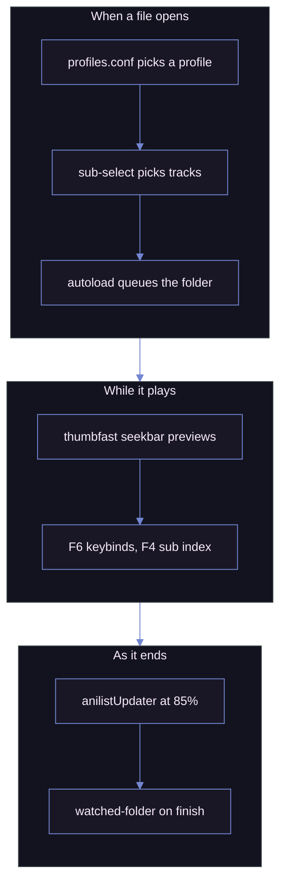

# MPV

My mpv setup: player settings, a keybind map I keep expanding, a [uosc][UOSC] theme, and the script selection I actually use.

| Playing, with the interface showing |
| ----------------------------------- |
| ![mpv playing][shot_playing]        |

> [!IMPORTANT]
> Two things are deliberately missing: the **shaders**, too large to commit, and the **[uosc][UOSC] folder**, taken from upstream. uosc carries one local change, kept in [`patches/`][patches_dir] rather than as a fork: run `just patch` after installing or updating it, or the menu reverts to stock.

## The uosc theme

Moonlight: dark, low-contrast, the interface kept thin, set in [`uosc.conf`][uosc_conf].

| Role              | Hex       | Used for                       |
| ----------------- | --------- | ------------------------------ |
| `foreground`      | `#ced9ff` | Timeline fill, active controls |
| `foreground_text` | `#0d0e17` | Text on top of that fill       |
| `background`      | `#191726` | Menus, tooltips, bars          |
| `background_text` | `#f8eaf8` | Text on those surfaces         |
| `curtain`         | `#0d0e17` | Dim behind open menus          |
| `success`         | `#49ef95` | Positive feedback              |
| `error`           | `#ca5f71` | Failures                       |

Shape matters as much: `timeline_style=bar` at 20px, `top_bar=no-border`, `border_radius=6`, `font_scale=1.18`, `font_bold=yes`. Most surfaces sit under full opacity; the title is transparent, so nothing floats over the video. Menus run at `submenu=1` opacity, so every open level reads as one surface rather than fading into the background.

| At rest: the minimized timeline alone | Woken: top bar, controls, timeline |
| ------------------------------------- | ---------------------------------- |
| ![Minimized timeline][shot_minimal]   | ![Full interface][shot_interface]  |

`TAB` toggles the interface as a whole, `SHIFT+TAB` toggles that last bar. The timeline colours the ranges it recognises, so the OP, the ED and the preview read as bands rather than as chapter ticks: `chapter_ranges` sets those colours, with `chapter_range_patterns` teaching it the shorthand titles releases actually use.

### The menu patch

uosc centres whichever menu level is current and slides the whole stack to get there, so walking a path moves everything under the pointer. [`patches/uosc-cascade-menu.patch`][uosc_patch] makes it behave like a native context menu instead:

- the root opens where you clicked, and each submenu lines up with the item that opens it
- levels are placed by depth, so opening or leaving one never moves the others
- resting on an item walks in, resting on a parent column walks back out, no click needed; a pointer still travelling is ignored, so passing over an item never opens it
- the hovered entry's description and command are drawn under the menu, on top of every level

The folder is gitignored and uosc's updater overwrites it, so the change lives as a patch rather than as edits in the tree. [`patches/apply.py`][apply_py] applies it with the standard library alone.

## Install

Copy `portable_config/` next to `mpv.exe`. Two folders you supply.


## Scripts I wrote

Five of them, all on the Moonlight palette.

| The keyboard map and the subtitle index, in motion |
| -------------------------------------------------- |
| ![Keyboard map and subtitle index][shot_map_gif]   |

### [`keybind-visualizer.lua`][keybind_visualizer]

An on-screen keyboard on `F6`. Hover a key to see what it does; `ESC` closes it.

Bindings are read live from `input-bindings`, so it reflects your `input.conf` plus the builtins, with no list to maintain.

| Searching every binding for `sub`           |
| ------------------------------------------- |
| ![Keyboard map, searching][shot_map_search] |

Just type to search them. The query matches key names, combos, descriptions and commands. Each typed word matches as a substring, as a gapped run inside a single word (`sbdly` finds `sub-delay`) or as word initials, so a scatter of letters never lights up half the keyboard. Typed characters are picked out inside each description. `BS` erases, `ESC` clears the query and then closes.

A `≡` badge marks anything that also lives in the uosc menu: in the corner of the key, and beside the binding's own line in the panel. Those entries describe themselves, so the panel shows the description rather than the raw command.

mpv cannot detect the OS keyboard layout, so layouts live in a JSON file. Pick `ansi`, `iso`, `abnt2`, `jis`, or add your own.

| File                                                            | Purpose                                                   |
| --------------------------------------------------------------- | --------------------------------------------------------- |
| [`keybind-visualizer.conf`][keybind_visualizer_conf]            | Selects the `layout` and points at the layouts file       |
| [`keybind-visualizer-layouts.json`][keybind_visualizer_layouts] | The layout definitions; edit to move keys or add a layout |

### [`sub-seek.lua`][sub_seek]

A fullscreen, clickable index of every subtitle line with timestamps, on `F4`. Click a line, or arrow to it and press Enter. Unlike the builtin sub-seek, you jump anywhere instead of stepping.

Type to filter it down: every word typed has to appear in the line, so `long line` keeps only those carrying both, and the hits are picked out where they sit. `BS` erases, `ESC` clears the query and then closes.

mpv exposes no "all subtitle lines" API, so the track is dumped to a temporary `.srt` with ffmpeg and parsed; ASS and embedded subs get flattened on the way.

| Every line of the track, the one playing highlighted | Filtered down to the lines that match |
| --- | --- |
| ![Subtitle index][shot_sub_seek] | ![Subtitle index, searching][shot_sub_search] |

### [`uosc-menu.lua`][uosc_menu]

uosc builds its menu from the `#!` comments in `input.conf`, but its items get no icon and say nothing about themselves. This reads the same comments, understands two more tokens, and hands uosc the finished menu through its public `open-menu` message, so no uosc file is touched.

| Every entry with its icon and key | The hovered entry explained under the cascade |
| --------------------------------- | --------------------------------------------- |
| ![Menu root][shot_menu_root]      | ![Tools submenu][shot_menu_tools]             |

| Fonts as a radio group               | Shaders ticked three levels in          |
| ------------------------------------ | --------------------------------------- |
| ![Font radio group][shot_menu_radio] | ![Shader checkboxes][shot_menu_cascade] |

<details>

<summary>The syntax, for when you edit the tree</summary>

```conf
g cycle interpolation   #! Video @movie > Interpolation @animation ?Resamples frames to the display rate
#                       #! Video > ---
```

| Token   | Does                                                                                     |
| ------- | ---------------------------------------------------------------------------------------- |
| `@name` | A [Material Icons Rounded][icons] ligature, on any part of the path                      |
| `?text` | What the entry does, shown under the menu on hover, next to the command it runs          |
| `---`   | A separator under the last entry of the level it sits in, so `Video > ---`, one level up |

</details>

Entries that carry a state draw it instead of their icon, re-read on open: `cycle <prop>`, `af toggle` and `change-list glsl-shaders toggle` become checkboxes, while entries setting the same property with `set <prop> <value>` become a radio group. Those keep the menu open when clicked and redraw in place, so a shader chain can be built in one visit.

Bound to `MBTN_RIGHT`, which anchors it at the pointer, and to `MENU` and the uosc menu button, which open it centred.

### [`sub-font.lua`][sub_font]

One font choice, whatever the subtitle file turns out to be. Plain text subtitles carry no styling, so mpv draws them with `sub-font`; ASS scripts carry their own styles and only listen to `sub-ass-style-overrides`, which does nothing for plain text.

This mirrors `sub-font` into a `FontName` override, leaving other overrides alone, so `F8` and `Subtitle > Font` land on both. `script-message-to sub_font use-file-font` drops the override again, for when an ASS script should use the typeface it names. ASS styling only gives way when `sub-ass-override` is `yes` or higher, which is what `u` toggles.

### [`reset-all.lua`][reset_all]

`ALT+F5` puts playback back to a fresh-start state without reloading the file: zoom, pan, aspect, rotation, panscan, speed, both delays, subtitle scale, position and visibility, and the colour controls, then clears `glsl-shaders`. Volume and mute are left alone, so a reset never blasts audio.

## Configuration

| File                            | What it holds                                                                                  |
| ------------------------------- | ---------------------------------------------------------------------------------------------- |
| [`mpv.conf`][mpv_conf]          | Preferred languages, OSC and window behaviour, subtitle styling, video output and tone mapping |
| [`input.conf`][input_conf]      | Every keybind, plus the uosc menu                                                              |
| [`profiles.conf`][profile_conf] | Conditional profiles                                                                           |
| [`fonts.conf`][fonts_conf]      | Legacy; loaded Windows fonts before `fonts/` replaced it                                       |

| Bindings grouped by keyboard row             | The menu, written on the same lines       |
| -------------------------------------------- | ----------------------------------------- |
| ![input.conf, function rows][shot_conf_keys] | ![input.conf, menu block][shot_conf_menu] |

`input.conf` is the piece I put the most into: mine active among the commented ones, then the shader keys and the uosc menu. Of all the configs I read for inspiration, none were this complete.

`profiles.conf` swaps the shader chain and subtitle styling when the path contains `Animation`, plus profiles for audio-only files and upscaling.

## Script selection

Most fire off playback itself, no keypress needed.



<details>

<summary>The thirteen scripts I did not write</summary>

| Script                                   | Source                            | What it does                                            |
| ---------------------------------------- | --------------------------------- | ------------------------------------------------------- |
| [`anilistUpdater`][anilist]              | [AzuredBlue][anilist_src]         | Marks the episode watched on AniList at 85%             |
| [`autoload.lua`][autoload]               | [mpv][autoload_src]               | Queues the neighbouring files in the folder             |
| [`chapters.lua`][chapters]               | [mar04][chapters_src]             | Create, edit and save chapters                          |
| [`clipshot.lua`][clipshot]               | [ObserverOfTime][clipshot_src]    | Screenshot straight to the clipboard                    |
| [`pause-indicator.lua`][pause_indicator] | [CogentRedTester][crt]            | Pause glyph in the corner                               |
| [`reactive_vf_bypass.lua`][vf_bypass]    | [allecsc][allecsc]                | Keeps the SVP filter chain honest                       |
| [`restart-mpv.lua`][restart_mpv]         | mine                              | Reloads the file so config edits apply                  |
| `skip-chapters.lua`                      | unattributed                      | Auto-skips chapters matching OP, ED, credits or preview |
| [`skip-to-silence.lua`][skip_silence]    | [detuur][detuur]                  | Jumps to the next silence, usually the OP's end         |
| [`sub-export.lua`][sub_export]           | [kelciour][kelciour]              | Extracts the current subtitle next to the video         |
| [`sub-select.lua`][sub_select]           | [CogentRedTester][sub_select_src] | Picks audio and subtitle tracks by rules                |
| [`thumbfast.lua`][thumbfast]             | [po5][thumbfast_src]              | Seekbar hover thumbnails                                |
| [`watched-folder.lua`][watched_folder]   | mine                              | Moves a finished file to a "watched" folder             |

</details>

Several carry local patches, `thumbfast.lua` most of all.

`watched-folder.lua` has two known bugs: it fires when you switch files without finishing, and it skips the last file in a playlist.

<details>

<summary>Scripts kept but not loaded</summary>

Tried and dropped, kept for reference: `autodeint.lua`, `better-chapter.lua`, `inputevent.lua`, `memo.lua`, `mute-on-specific-subtitle-words.js`, `osc.lua`, `pause-indicator-middle.lua`, `sub-bilingual.lua`.

</details>

## Shaders and fonts

Shaders, [Anime4K][Anime4k] among them, are too large to commit; [`shaders_list.txt`][shaders_list] names them. Fonts sit in `fonts/`, which loads faster than the Windows font folder.

<!-- URLS -->

[shot_playing]: assets/mpv-playing.png
[shot_map_gif]: assets/keybind-visualizer-and-sub-seek.gif
[shot_map_search]: assets/keybind-visualizer-search.png
[shot_sub_seek]: assets/sub-seek.png
[shot_sub_search]: assets/sub-seek-search.png
[shot_menu_root]: assets/uosc-menu-root.png
[shot_menu_tools]: assets/uosc-menu-tools.png
[shot_menu_radio]: assets/uosc-menu-radio.png
[shot_menu_cascade]: assets/uosc-menu-cascade.png
[shot_minimal]: assets/uosc-minimal.png
[shot_interface]: assets/uosc-chrome.png
[shot_conf_keys]: assets/input-conf-keys.png
[shot_conf_menu]: assets/input-conf-menu.png
[patches_dir]: ./patches
[keybind_visualizer]: ./portable_config/scripts/keybind-visualizer.lua
[keybind_visualizer_conf]: ./portable_config/script-opts/keybind-visualizer.conf
[keybind_visualizer_layouts]: ./portable_config/script-opts/keybind-visualizer-layouts.json
[sub_seek]: ./portable_config/scripts/sub-seek.lua
[Anime4k]: https://github.com/bloc97/Anime4K
[UOSC]: https://github.com/tomasklaen/uosc
[mpv_conf]: ./portable_config/mpv.conf
[input_conf]: ./portable_config/input.conf
[profile_conf]: ./portable_config/profiles.conf
[fonts_conf]: ./portable_config/fonts.conf
[uosc_conf]: ./portable_config/script-opts/uosc.conf
[shaders_list]: ./portable_config/shaders/shaders_list.txt
[anilist]: ./portable_config/scripts/anilistUpdater
[anilist_src]: https://github.com/AzuredBlue/mpv-anilist-updater
[autoload]: ./portable_config/scripts/autoload.lua
[autoload_src]: https://github.com/mpv-player/mpv
[chapters]: ./portable_config/scripts/chapters.lua
[chapters_src]: https://github.com/mar04/chapters_for_mpv
[clipshot]: ./portable_config/scripts/clipshot.lua
[clipshot_src]: https://github.com/ObserverOfTime/mpv-scripts
[pause_indicator]: ./portable_config/scripts/pause-indicator.lua
[crt]: https://github.com/CogentRedTester/mpv-scripts
[vf_bypass]: ./portable_config/scripts/reactive_vf_bypass.lua
[allecsc]: https://github.com/allecsc/mpv-qol-scripts
[reset_all]: ./portable_config/scripts/reset-all.lua
[sub_font]: ./portable_config/scripts/sub-font.lua
[uosc_menu]: ./portable_config/scripts/uosc-menu.lua
[uosc_patch]: ./patches/uosc-cascade-menu.patch
[apply_py]: ./patches/apply.py
[restart_mpv]: ./portable_config/scripts/restart-mpv.lua
[skip_silence]: ./portable_config/scripts/skip-to-silence.lua
[detuur]: https://github.com/detuur/mpv-scripts
[sub_export]: ./portable_config/scripts/sub-export.lua
[kelciour]: https://github.com/kelciour/mpv-scripts
[sub_select]: ./portable_config/scripts/sub-select.lua
[sub_select_src]: https://github.com/CogentRedTester/mpv-sub-select
[thumbfast]: ./portable_config/scripts/thumbfast.lua
[thumbfast_src]: https://github.com/po5/thumbfast
[watched_folder]: ./portable_config/scripts/watched-folder.lua
[icons]: https://fonts.google.com/icons?icon.set=Material+Icons&icon.style=Rounded
