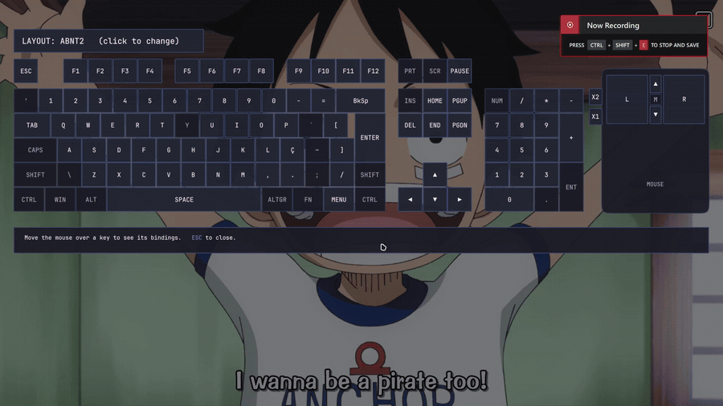

# MPV

This is the most customizable media player I've ever used. It's a free and open-source media player that supports a wide range of media formats.

Here I keep my mpv scripts and configurations.

Paste the `/portable_config` folder into your `./portable_config/mpv/` folder, doing so you load the configurations and scripts.

  
  &nbsp;&nbsp;
  

> [!NOTE]
> The config files, fonts and scripts are all here. Only two things are left out: the shaders, because of their size, and the [UOSC][UOSC] folder, because I keep it unmodified from upstream.

## scripts

These are the scripts I wrote, both share the Moonlight color palette.

  

### [`keybind-visualizer.lua`][keybind_visualizer]

An interactive on-screen keyboard for mpv. Toggle it (`script-binding keybind-visualizer`), then move the mouse over any key to see its bindings. Close with `ESC` or by toggling again.

Bindings are read live from mpv's `input-bindings` property, so it reflects whatever you have in `input.conf` plus the builtin defaults.

The drawn physical layouts live in an external JSON data file, since mpv cannot auto-detect the OS keyboard layout. Pick one (`ansi`, `iso`, `abnt2` or `jis`) or add your own through its options.

- [`keybind-visualizer.conf`][keybind_visualizer_conf]: selects the `layout` to draw and points to the `layouts_file`.
- [`keybind-visualizer-layouts.json`][keybind_visualizer_layouts]: holds the layout definitions. Edit it to tweak key positions or add layouts.

### [`sub-seek.lua`][sub_seek]

A fullscreen, clickable list of every subtitle line with timestamps. Click a line (or select with Up/Down + Enter) to seek to it. It behaves like the built-in sub-seek keybind, but lets you jump to any line.

mpv exposes no API for "all subtitle lines", so the currently selected sub track is extracted to a temporary `.srt` with ffmpeg and parsed. ASS/embedded subs are converted to plain timed text by ffmpeg.

Bind it in `input.conf`, e.g. `F7 script-binding sub-seek-list`.

## Configuration

### Main folder

Here we have the main configuration files for MPV.

#### [`mpv.conf`][mpv_conf]

This is the main configuration file for MPV, here I set the general configurations for the player. I've set it up in categories to make it easier to understand, here are type of configurations that you can find:

- Prefered languages/subtitles
- OSC configurations (if has border, initial size/position/volume)
- Default subtitle configurations (font, size, position, etc)

#### [`input.conf`][input_conf]

  
  

This is my masterpiece, I've mapped as comment ~~almost~~ all the possible keybinds that you can use with MPV, split by the keyboard row. I've also mapped some of the most used keybinds that I use with MPV.

After all the mappings, there's the shader keybinds and finally the UOSC context menu keybinds.

Of all `input.conf` files I've searched as inspiration, this is the most complete and organized that I've found.

#### [`profile.conf`][profile_conf]

File where you can set conditions for different profiles, like if you are watching a movie or a series, you can set different configurations for each one.

I only have a simple "Animation" profile, that changes the applied shader and default subtitle styling to my liking. It is applied to the files where the parent folder name contains "Animation".

#### [`fonts.conf`][fonts_conf]

Not really needed anymore since I started using the `fonts` folder, but I keep it here just in case.

It was used to enable MPV to use Windows fonts folder to load fonts, without this file, it wouldn't load isntalled fonts.

### scripts

Here lies the scripts that I use with MPV, some of them were written by me, others I found on the internet and modified to my needs.

#### [`autoload.lua`][autoload]

This script automatically loads playlist entries before and after the the currently played file.

#### [`pause-indicator.lua`][pause_indicator]

Shows an indicator in the top right side when the video is paused.

#### [`restart-mpv.lua`][restart_mpv]

Reloads the current file, useful when you change the configurations and want to apply them without restarting the player.

#### [`sub-export.lua`][sub_export]

Tries to extract the current subtitle from the video and save it in the same folder as the video.

#### [`sub-select.lua`][sub_select]

Auto select the audio and subtitle tracks based on the tracks name/id, highly customizable.

#### [`thumbfast.lua`][thumbfast]

Generates hover thumbnails for the seekbar.

#### [`watched-folder.lua`][watched_folder]

Send the current file to a "watched" folder after finishing it.

As I'm not used to the Lua language, it has some bugs:

- Sends even when changing the file without finishing it
- Don't send the last file of the playlist

#### UOSC

> Feature-rich minimalist proximity-based UI for MPV player.

The imported folder from [UOSC][UOSC]. Not uploaded here, since I keep it unmodified: get it from upstream and drop it into `scripts/`.

### script-opts

Some scripts require additional options to be set that are kept in this folder.

### shaders

Here I keep the shaders that I use with MPV. Got them from various sources, like [Anime4K][Anime4k]. I don't upload them to my repository due to their size, but you can find them on the internet.

I've included a `shaders_list.txt` file that lists the names of the shaders that I have, may be useful.

### fonts

Here I keep the fonts that I use with MPV, it is possible to load directly from Windows fonts, but can be slow sometimes.

<!-- URLS -->

[keybind_visualizer]: ./portable_config/scripts/keybind-visualizer.lua
[keybind_visualizer_conf]: ./portable_config/script-opts/keybind-visualizer.conf
[keybind_visualizer_layouts]: ./portable_config/script-opts/keybind-visualizer-layouts.json
[sub_seek]: ./portable_config/scripts/sub-seek.lua
[Anime4k]: https://github.com/bloc97/Anime4K
[UOSC]: https://github.com/tomasklaen/uosc
[mpv_conf]: ./portable_config/mpv.conf
[input_conf]: ./portable_config/input.conf
[profile_conf]: ./portable_config/profiles.conf
[fonts_conf]: ./portable_config/fonts.conf
[autoload]: ./portable_config/scripts/autoload.lua
[pause_indicator]: ./portable_config/scripts/pause-indicator.lua
[restart_mpv]: ./portable_config/scripts/restart-mpv.lua
[sub_export]: ./portable_config/scripts/sub-export.lua
[sub_select]: ./portable_config/scripts/sub-select.lua
[thumbfast]: ./portable_config/scripts/thumbfast.lua
[watched_folder]: ./portable_config/scripts/watched-folder.lua
