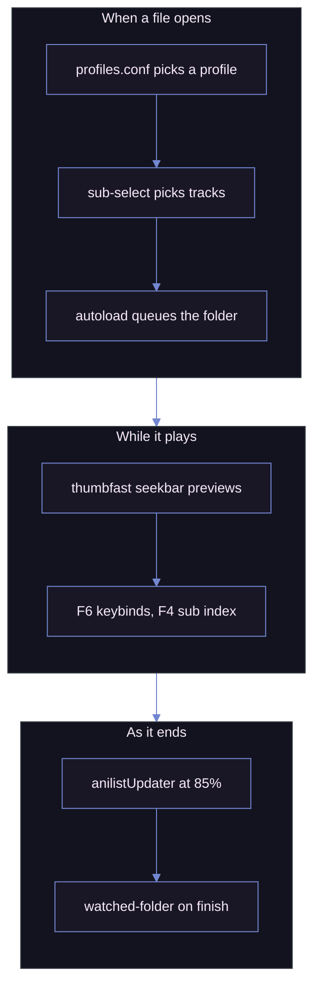

# MPV

My mpv setup: player settings, a keybind map, a [uosc][UOSC] theme, and the scripts I run.

| Playing, with the interface showing |
| ----------------------------------- |
| ![mpv playing][shot_playing]        |

> [!IMPORTANT]
> Two things are deliberately missing: the **shaders**, too large to commit, and the **[uosc][UOSC] folder**, taken from upstream. uosc carries one local change kept in [`patches/`][patches_dir] rather than a fork: run `just patch` after installing or updating it, or the menu reverts to stock.

## The uosc theme

Moonlight: dark, low-contrast, thin, set in [`uosc.conf`][uosc_conf].

| At rest: the minimized timeline alone | Woken: top bar, controls, timeline |
| ------------------------------------- | ---------------------------------- |
| ![Minimized timeline][shot_minimal]   | ![Full interface][shot_interface]  |

`TAB` toggles the whole interface, `SHIFT+TAB` just the bottom bar. The timeline colours recognised ranges, so the OP, the ED and the preview read as bands rather than ticks.

### The menu patch

[`patches/uosc-cascade-menu.patch`][uosc_patch] makes uosc's menu behave like a native context menu: opens where you clicked, cascades by depth instead of centring and sliding, walks in and out on hover. The folder is gitignored, so [`patches/apply.py`][apply_py] reapplies it after every uosc update.

## Install

`just first-run` sets up mpv, uosc, the shaders, your keyboard layout and AniList automatically, then shows a receipt before anything runs. [`first-run.py`][first_run] is standard library only: `python first-run.py` works with no `just` installed.

| Mode       | Where mpv goes            | The config                          |
| ---------- | -------------------------- | ------------------------------------ |
| `here`     | this repo folder           | read in place, edits are live at once |
| `system`   | the mpv you already have   | copied beside that executable       |
| `portable` | a folder you name          | copied there, nothing else touched  |

Pick `here` if you'll keep editing the config.

| Start                          | The first question                     | The receipt, before anything runs  |
| ------------------------------ | -------------------------------------- | ---------------------------------- |
| ![Banner][shot_first_run_banner] | ![Install mode][shot_first_run_install] | ![Receipt][shot_first_run_receipt] |

### What has to be on the machine

| Tool         | Needed for                                                             | Without it                                        |
| ------------ | ---------------------------------------------------------------------- | ------------------------------------------------- |
| mpv          | everything                                                             | nothing runs                                      |
| ffmpeg       | `F4` subtitle index, subtitle export, chapter remux                    | those three fail silently at the moment you press |
| Python 3.8+  | `just patch`, the AniList scripts, `first-run.py`                      | no uosc patch and no AniList                      |
| [uv][uv]     | `just setup`, which vendors `requests` and `guessit`                   | `first-run.py` falls back to `pip`                |
| [just][just] | the recipes below                                                      | run the command inside each recipe by hand        |

mpv has no official Windows binary; pick a build from [mpv.io/installation][mpv_install].

By hand instead: copy `portable_config/` next to `mpv.exe`, add uosc and shaders yourself.


Anime4K shaders must sit in `shaders/Anime4K/`, the name `profiles.conf` and `CTRL+1` through `CTRL+7` expect. `F6`'s keyboard layout is set in [`keybind-visualizer.conf`][keybind_visualizer_conf], shipped as `abnt2` (Brazilian); change it to `ansi`, `iso` or `jis`.

## Scripts I wrote

Twelve, the interface ones all on the Moonlight palette.

### [`keybind-visualizer.lua`][keybind_visualizer]

An on-screen keyboard on `F6`, read live from `input-bindings`. Hover a key or type to search; `≡` marks anything that also lives in the uosc menu.

| Searching every binding for `delay`         | Hovering a single key                     |
| ------------------------------------------- | ----------------------------------------- |
| ![Keyboard map, searching][shot_map_search] | ![Keyboard map, hovering][shot_map_hover] |

mpv can't detect your keyboard layout: pick `ansi`, `iso`, `abnt2`, `jis`, or add your own.

| File                                                            | Purpose                                                   |
| --------------------------------------------------------------- | --------------------------------------------------------- |
| [`keybind-visualizer.conf`][keybind_visualizer_conf]            | Selects the `layout` and points at the layouts file       |
| [`keybind-visualizer-layouts.json`][keybind_visualizer_layouts] | The layout definitions; edit to move keys or add a layout |

### [`sub-seek.lua`][sub_seek]

Fullscreen, clickable index of every subtitle line with timestamps, on `F4`. Type to filter, click a line or arrow to it and press Enter.

| Every line of the track, the one playing highlighted | Filtered down to the lines that match         |
| ---------------------------------------------------- | --------------------------------------------- |
| ![Subtitle index][shot_sub_seek]                     | ![Subtitle index, searching][shot_sub_search] |

### [`uosc-menu.lua`][uosc_menu]

Builds uosc's menu from `input.conf`'s `#!` comments, adding icons and hover descriptions with two extra tokens; nothing in uosc itself is touched. Entries become checkboxes or radio groups automatically, re-read every time the menu opens.

| Every entry with its icon and key | The hovered entry explained under the cascade |
| --------------------------------- | --------------------------------------------- |
| ![Menu root][shot_menu_root]      | ![Tools submenu][shot_menu_tools]             |

| Fonts as a radio group               | The Anime4K presets, six levels deep  |
| ------------------------------------ | ------------------------------------- |
| ![Font radio group][shot_menu_radio] | ![Anime4K cascade][shot_menu_cascade] |

| Speeds as a radio group               | Subtitle placement, the live one marked    |
| ------------------------------------- | ------------------------------------------ |
| ![Playback speed][shot_menu_playback] | ![Subtitle placement][shot_menu_placement] |

| Every loudness filter as a checkbox   | The colour controls                    |
| ------------------------------------- | -------------------------------------- |
| ![Audio loudness][shot_menu_loudness] | ![Picture controls][shot_menu_picture] |

<details>

<summary>The syntax, for when you edit the tree</summary>

```conf
g cycle interpolation   #! Video @movie > Interpolation @animation ?Resamples frames to the display rate
#                       #! Video > ---
```

| Token   | Does                                                                                     |
| ------- | ---------------------------------------------------------------------------------------- |
| `@name` | A [Material Icons Rounded][icons] ligature, on any part of the path                      |
| `?text` | What the entry does, shown under the menu on hover, next to the command it runs          |
| `---`   | A separator under the last entry of the level it sits in, so `Video > ---`, one level up |

</details>

Right-click opens it at the pointer; `MENU` or the uosc menu button open it centred.

### [`chapters-menu.lua`][chapters_menu]

A uosc front end for [`chapters.lua`][chapters] on `c`: every chapter listed with its timestamp, add/rename/delete from the menu, and a check against YouTube's chapter rules.

| Every chapter, and what can be done to them | The YouTube rules, checked one by one |
| ------------------------------------------- | ------------------------------------- |
| ![Chapter menu][shot_chapters]              | ![YouTube check][shot_chapters_check] |

### [`sub-select-menu.lua`][sub_select_menu]

Shows which [`sub-select.lua`][sub_select] rule picked the current subtitle track, on `ALT+SHIFT+s`, with a switch to turn it off.

| Which rule picked the track showing right now |
| --------------------------------------------- |
| ![Automatic subtitle selection][shot_subsel]  |

### [`sub-font.lua`][sub_font]

One font for every subtitle, ASS or plain text: mirrors `sub-font` into a `FontName` override so `F8` and `Subtitle > Font` pick it consistently. `u` toggles whether ASS styling can override it.

### [`osd-theme.lua`][osd_theme]

One shape and palette for every on-screen message, used by every script here instead of raw `mp.osd_message`.

| The message a keybind leaves on screen | Work that takes a while, with the same spinner uosc uses |
| -------------------------------------- | -------------------------------------------------------- |
| ![Themed OSD message][shot_osd_theme]  | ![Busy message][shot_osd_busy]                           |

`busy` spins for slow work instead of fading; `clear` removes a message outright, for a script that draws its own interface next.

### [`reset-all.lua`][reset_all]

`ALT+F5` resets playback (zoom, pan, aspect, speed, delays, subtitles, colour, shaders) without reloading the file. Volume and mute are left alone.

### [`pause-indicator.lua`][pause_indicator]

A pause glyph in the top right, replacing [CogentRedTester's][crt] mid-screen version with one that matches the interface.

### [`skip-chapters.lua`][skip_chapters]

Auto-skips chapters named opening, ending, credits or preview; `F11` turns it off for a badly named release.

### [`restart-mpv.lua`][restart_mpv]

`F5` relaunches the player on the same file at the same position, so a config edit can be tested without losing your place.

### [`watched-folder.lua`][watched_folder]

`F10` toggles it: a finished file moves into `watched/` once the next file starts. Two known bugs: fires on an unfinished switch, skips a playlist's last file.

## AniList, rewritten around the player

[`anilistUpdater`][anilist] is [AzuredBlue's][anilist_src], marking episodes watched at 85%. Everything below is local, so an upstream pull reverts it.

| Everything the panel knows about the file playing |
| ------------------------------------------------- |
| ![AniList panel][shot_anilist]                    |

`n` opens the panel; `CTRL+n` marks it watched without opening anything. Wrong guess? Search or paste a URL/id from the same panel.

Token setup: open [the authorize link][anilist_auth], approve it, copy the token AniList shows, press `CTRL+n` on the panel's link row. Stored encrypted under `%LOCALAPPDATA%\mpv-anilist\` rather than as a plain text file, tied to the Windows account.

## Configuration

| File                            | What it holds                                                                                  |
| ------------------------------- | ---------------------------------------------------------------------------------------------- |
| [`mpv.conf`][mpv_conf]          | Languages, OSC/window behaviour, subtitle styling, video output, tone mapping                  |
| [`input.conf`][input_conf]      | Every keybind, plus the uosc menu                                                              |
| [`profiles.conf`][profile_conf] | Conditional profiles                                                                           |
| [`fonts.conf`][fonts_conf]      | Legacy; loaded Windows fonts before `fonts/` replaced it                                       |

| Bindings grouped by keyboard row             | The menu, written on the same lines       |
| -------------------------------------------- | ----------------------------------------- |
| ![input.conf, function rows][shot_conf_keys] | ![input.conf, menu block][shot_conf_menu] |

`profiles.conf` swaps the shader chain and subtitle styling when the path contains `Animation`, plus profiles for audio-only files and upscaling.

## Script selection

Most run off playback events, no keypress needed.



<details>

<summary>The ten scripts I did not write</summary>

Each carries an added header line naming its upstream, so a file on disk always says where it came from. Beyond that, the three at the top differ; the rest are stock.

| Script                                           | Source                            | What it does                                    | Local change                                                                                                               |
| ------------------------------------------------ | --------------------------------- | ----------------------------------------------- | -------------------------------------------------------------------------------------------------------------------------- |
| [`thumbfast.lua`][thumbfast]                     | [po5][thumbfast_src]              | Seekbar hover thumbnails                        | Expands `~~/` in `mpv_path`; a 10s watchdog kills a hung spawn                                                             |
| [`sub-export.lua`][sub_export]                   | [kelciour][kelciour]              | Extracts the current subtitle next to the video | Runs in the background rather than freezing the player; spinner and percentage from ffmpeg's own progress; themed messages |
| [`skip-to-silence.lua`][skip_silence]            | [detuur][detuur]                  | Jumps to the next silence, usually the OP's end | `F9` rather than `F3`; themed message                                                                                      |
| [`anilistUpdater`][anilist]                      | [AzuredBlue][anilist_src]         | Marks the episode watched on AniList at 85%     | [Rewritten around the player](#anilist-rewritten-around-the-player)                                                        |
| [`autoload.lua`][autoload]                       | [mpv][autoload_src]               | Queues the neighbouring files in the folder     | Stock                                                                                                                      |
| [`chapters.lua`][chapters]                       | [mar04][chapters_src]             | Create, edit and save chapters                  | Stock; driven by [`chapters-menu.lua`][chapters_menu] rather than its own bindings                                         |
| [`clipshot.lua`][clipshot]                       | [ObserverOfTime][clipshot_src]    | Screenshot straight to the clipboard            | Stock                                                                                                                      |
| [`sub-select.lua`][sub_select]                   | [CogentRedTester][sub_select_src] | Picks audio and subtitle tracks by rules        | Publishes its rules and its match over `user-data`, for [`sub-select-menu.lua`][sub_select_menu]                           |
| [`reactive_vf_bypass.lua`][vf_bypass]            | [allecsc][allecsc]                | Keeps the SVP filter chain honest               | Stock                                                                                                                      |
| [`reactive_vf_bypass_keyword.lua`][vf_bypass_kw] | [allecsc][allecsc]                | The same, matched by keyword                    | Stock                                                                                                                      |

</details>

Formatted with the repo's [stylua][stylua] settings, so a diff against upstream is mostly reindentation.

<details>

<summary>Scripts kept but not loaded</summary>

Tried and dropped, kept for reference in `scripts/.unused/`, which mpv skips: `autodeint.lua`, `better-chapter.lua`, `inputevent.lua`, `memo.lua`, `mute-on-specific-subtitle-words.js`, `osc.lua`, `pause-indicator-middle.lua`, `sub-bilingual.lua`.

</details>

## Shaders and fonts

Shaders, [Anime4K][Anime4k] among them, are too large to commit; [`shaders_list.txt`][shaders_list] names them. Fonts sit in `fonts/`, which loads faster than the Windows font folder.

<!-- URLS -->

[shot_playing]: assets/mpv-playing.png
[shot_map_search]: assets/keybind-visualizer-search.png
[shot_map_hover]: assets/keybind-visualizer-hover.png
[shot_osd_theme]: assets/osd-theme.png
[shot_sub_seek]: assets/sub-seek.png
[shot_sub_search]: assets/sub-seek-search.png
[shot_menu_root]: assets/uosc-menu-root.png
[shot_menu_tools]: assets/uosc-menu-tools.png
[shot_menu_radio]: assets/uosc-menu-radio.png
[shot_menu_cascade]: assets/uosc-menu-cascade.png
[shot_menu_playback]: assets/uosc-menu-playback.png
[shot_menu_placement]: assets/uosc-menu-placement.png
[shot_menu_loudness]: assets/uosc-menu-loudness.png
[shot_menu_picture]: assets/uosc-menu-picture.png
[shot_chapters]: assets/chapters-menu.png
[shot_chapters_check]: assets/chapters-menu-check.png
[shot_subsel]: assets/sub-select-menu.png
[shot_anilist]: assets/anilist-menu.png
[shot_osd_busy]: assets/osd-theme-busy.png
[shot_minimal]: assets/uosc-minimal.png
[shot_interface]: assets/uosc-chrome.png
[shot_conf_keys]: assets/input-conf-keys.png
[shot_conf_menu]: assets/input-conf-menu.png
[shot_first_run_banner]: assets/first-run-banner.png
[shot_first_run_install]: assets/first-run-install.png
[shot_first_run_receipt]: assets/first-run-receipt.png
[patches_dir]: ./patches
[keybind_visualizer]: ./portable_config/scripts/keybind-visualizer.lua
[keybind_visualizer_conf]: ./portable_config/script-opts/keybind-visualizer.conf
[keybind_visualizer_layouts]: ./portable_config/script-opts/keybind-visualizer-layouts.json
[sub_seek]: ./portable_config/scripts/sub-seek.lua
[Anime4k]: https://github.com/bloc97/Anime4K
[UOSC]: https://github.com/tomasklaen/uosc
[mpv_conf]: ./portable_config/mpv.conf
[input_conf]: ./portable_config/input.conf
[profile_conf]: ./portable_config/profiles.conf
[fonts_conf]: ./portable_config/fonts.conf
[uosc_conf]: ./portable_config/script-opts/uosc.conf
[shaders_list]: ./portable_config/shaders/shaders_list.txt
[anilist]: ./portable_config/scripts/anilistUpdater
[anilist_src]: https://github.com/AzuredBlue/mpv-anilist-updater
[autoload]: ./portable_config/scripts/autoload.lua
[autoload_src]: https://github.com/mpv-player/mpv
[chapters]: ./portable_config/scripts/chapters.lua
[chapters_src]: https://github.com/mar04/chapters_for_mpv
[clipshot]: ./portable_config/scripts/clipshot.lua
[clipshot_src]: https://github.com/ObserverOfTime/mpv-scripts
[pause_indicator]: ./portable_config/scripts/pause-indicator.lua
[crt]: https://github.com/CogentRedTester/mpv-scripts
[vf_bypass]: ./portable_config/scripts/reactive_vf_bypass.lua
[allecsc]: https://github.com/allecsc/mpv-qol-scripts
[osd_theme]: ./portable_config/scripts/osd-theme.lua
[reset_all]: ./portable_config/scripts/reset-all.lua
[sub_font]: ./portable_config/scripts/sub-font.lua
[uosc_menu]: ./portable_config/scripts/uosc-menu.lua
[chapters_menu]: ./portable_config/scripts/chapters-menu.lua
[sub_select_menu]: ./portable_config/scripts/sub-select-menu.lua
[uv]: https://github.com/astral-sh/uv
[just]: https://github.com/casey/just
[first_run]: ./first-run.py
[mpv_install]: https://mpv.io/installation/
[anilist_auth]: https://anilist.co/api/v2/oauth/authorize?client_id=20740&response_type=token
[uosc_patch]: ./patches/uosc-cascade-menu.patch
[apply_py]: ./patches/apply.py
[restart_mpv]: ./portable_config/scripts/restart-mpv.lua
[skip_silence]: ./portable_config/scripts/skip-to-silence.lua
[detuur]: https://github.com/detuur/mpv-scripts
[sub_export]: ./portable_config/scripts/sub-export.lua
[kelciour]: https://github.com/kelciour/mpv-scripts
[sub_select]: ./portable_config/scripts/sub-select.lua
[sub_select_src]: https://github.com/CogentRedTester/mpv-sub-select
[thumbfast]: ./portable_config/scripts/thumbfast.lua
[thumbfast_src]: https://github.com/po5/thumbfast
[watched_folder]: ./portable_config/scripts/watched-folder.lua
[icons]: https://fonts.google.com/icons?icon.set=Material+Icons&icon.style=Rounded
[skip_chapters]: ./portable_config/scripts/skip-chapters.lua
[vf_bypass_kw]: ./portable_config/scripts/reactive_vf_bypass_keyword.lua
[stylua]: https://github.com/JohnnyMorganz/StyLua
