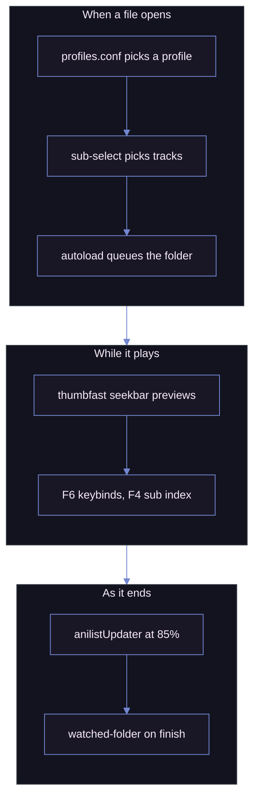

# MPV

My mpv setup: player settings, a keybind map I keep expanding, a [uosc][UOSC] theme, and the script selection I actually use.

  
  &nbsp;&nbsp;
  

> [!NOTE]
> Two things are deliberately missing: the **shaders**, too large to commit, and the **[uosc][UOSC] folder**, which I keep unmodified from upstream.

## Install

Copy `portable_config/` next to `mpv.exe`. Two folders you supply.

## Scripts I wrote

Both use the Moonlight palette below.

  

### [`keybind-visualizer.lua`][keybind_visualizer]

An on-screen keyboard on `F6`. Hover a key to see what it does; `ESC` closes it.

Bindings are read live from `input-bindings`, so it reflects your `input.conf` plus the builtins, with no list to maintain.

mpv cannot detect the OS keyboard layout, so layouts live in a JSON file. Pick `ansi`, `iso`, `abnt2`, `jis`, or add your own.

| File                                                            | Purpose                                                   |
| --------------------------------------------------------------- | --------------------------------------------------------- |
| [`keybind-visualizer.conf`][keybind_visualizer_conf]            | Selects the `layout` and points at the layouts file       |
| [`keybind-visualizer-layouts.json`][keybind_visualizer_layouts] | The layout definitions; edit to move keys or add a layout |

### [`sub-seek.lua`][sub_seek]

A fullscreen, clickable index of every subtitle line with timestamps, on `F4`. Click a line, or arrow to it and press Enter, to seek there. Like the builtin sub-seek, except you jump anywhere instead of stepping.

mpv exposes no "all subtitle lines" API, so the track is dumped to a temporary `.srt` with ffmpeg and parsed; ASS and embedded subs get flattened on the way.

## The uosc theme

Moonlight: dark, low-contrast, chrome kept thin. Set in [`uosc.conf`][uosc_conf].

| Role              | Hex       | Used for                       |
| ----------------- | --------- | ------------------------------ |
| `foreground`      | `#ced9ff` | Timeline fill, active controls |
| `foreground_text` | `#0d0e17` | Text on top of that fill       |
| `background`      | `#191726` | Menus, tooltips, bars          |
| `background_text` | `#f8eaf8` | Text on those surfaces         |
| `curtain`         | `#0d0e17` | Dim behind open menus          |
| `success`         | `#49ef95` | Positive feedback              |
| `error`           | `#ca5f71` | Failures                       |

Shape matters as much: `timeline_style=bar` at 20px, `top_bar=no-border`, `border_radius=2`, `font_scale=1.18`, `font_bold=yes`. Most surfaces sit under full opacity; the title is transparent, so nothing floats over the video.

## Configuration

| File                            | What it holds                                                                                  |
| ------------------------------- | ---------------------------------------------------------------------------------------------- |
| [`mpv.conf`][mpv_conf]          | Preferred languages, OSC and window behaviour, subtitle styling, video output and tone mapping |
| [`input.conf`][input_conf]      | Every keybind, plus the uosc menu                                                              |
| [`profiles.conf`][profile_conf] | Conditional profiles                                                                           |
| [`fonts.conf`][fonts_conf]      | Legacy; loaded Windows fonts before `fonts/` replaced it                                       |

  
  

`input.conf` is the piece I put the most into: every binding mpv accepts written out as a comment, grouped by keyboard row, with mine active among them, then the shader keys and the uosc menu. Of all the ones I read for inspiration, none were this complete.

`profiles.conf` swaps the shader chain and subtitle styling when the path contains `Animation`, plus profiles for audio-only files and upscaling.

## Script selection

Most fire off playback itself, no keypress needed.

| Script                                   | Source                            | What it does                                            |
| ---------------------------------------- | --------------------------------- | ------------------------------------------------------- |
| [`anilistUpdater`][anilist]              | [AzuredBlue][anilist_src]         | Marks the episode watched on AniList at 85%             |
| [`autoload.lua`][autoload]               | [mpv][autoload_src]               | Queues the neighbouring files in the folder             |
| [`chapters.lua`][chapters]               | [mar04][chapters_src]             | Create, edit and save chapters                          |
| [`clipshot.lua`][clipshot]               | [ObserverOfTime][clipshot_src]    | Screenshot straight to the clipboard                    |
| [`pause-indicator.lua`][pause_indicator] | [CogentRedTester][crt]            | Pause glyph in the corner                               |
| [`reactive_vf_bypass.lua`][vf_bypass]    | [allecsc][allecsc]                | Keeps the SVP filter chain honest                       |
| [`restart-mpv.lua`][restart_mpv]         | mine                              | Reloads the file so config edits apply                  |
| `skip-chapters.lua`                      | unattributed                      | Auto-skips chapters matching OP, ED, credits or preview |
| [`skip-to-silence.lua`][skip_silence]    | [detuur][detuur]                  | Jumps to the next silence, usually the OP's end         |
| [`sub-export.lua`][sub_export]           | [kelciour][kelciour]              | Extracts the current subtitle next to the video         |
| [`sub-select.lua`][sub_select]           | [CogentRedTester][sub_select_src] | Picks audio and subtitle tracks by rules                |
| [`thumbfast.lua`][thumbfast]             | [po5][thumbfast_src]              | Seekbar hover thumbnails                                |
| [`watched-folder.lua`][watched_folder]   | mine                              | Moves a finished file to a "watched" folder             |

Several carry local patches, `thumbfast.lua` most of all.

`watched-folder.lua` has two known bugs: it fires when you switch files without finishing, and it skips the last file in a playlist.

Scripts kept but not loaded

Tried and dropped, kept for reference: `autodeint.lua`, `better-chapter.lua`, `inputevent.lua`, `memo.lua`, `mute-on-specific-subtitle-words.js`, `osc.lua`, `pause-indicator-middle.lua`, `sub-bilingual.lua`.

## Shaders and fonts

Shaders, [Anime4K][Anime4k] among them, are too large to commit; [`shaders_list.txt`][shaders_list] names them all. Fonts sit in `fonts/` because the Windows font folder loads slower.

<!-- URLS -->

[keybind_visualizer]: ./portable_config/scripts/keybind-visualizer.lua
[keybind_visualizer_conf]: ./portable_config/script-opts/keybind-visualizer.conf
[keybind_visualizer_layouts]: ./portable_config/script-opts/keybind-visualizer-layouts.json
[sub_seek]: ./portable_config/scripts/sub-seek.lua
[Anime4k]: https://github.com/bloc97/Anime4K
[UOSC]: https://github.com/tomasklaen/uosc
[mpv_conf]: ./portable_config/mpv.conf
[input_conf]: ./portable_config/input.conf
[profile_conf]: ./portable_config/profiles.conf
[fonts_conf]: ./portable_config/fonts.conf
[uosc_conf]: ./portable_config/script-opts/uosc.conf
[shaders_list]: ./portable_config/shaders/shaders_list.txt
[anilist]: ./portable_config/scripts/anilistUpdater
[anilist_src]: https://github.com/AzuredBlue/mpv-anilist-updater
[autoload]: ./portable_config/scripts/autoload.lua
[autoload_src]: https://github.com/mpv-player/mpv
[chapters]: ./portable_config/scripts/chapters.lua
[chapters_src]: https://github.com/mar04/chapters_for_mpv
[clipshot]: ./portable_config/scripts/clipshot.lua
[clipshot_src]: https://github.com/ObserverOfTime/mpv-scripts
[pause_indicator]: ./portable_config/scripts/pause-indicator.lua
[crt]: https://github.com/CogentRedTester/mpv-scripts
[vf_bypass]: ./portable_config/scripts/reactive_vf_bypass.lua
[allecsc]: https://github.com/allecsc/mpv-qol-scripts
[restart_mpv]: ./portable_config/scripts/restart-mpv.lua
[skip_silence]: ./portable_config/scripts/skip-to-silence.lua
[detuur]: https://github.com/detuur/mpv-scripts
[sub_export]: ./portable_config/scripts/sub-export.lua
[kelciour]: https://github.com/kelciour/mpv-scripts
[sub_select]: ./portable_config/scripts/sub-select.lua
[sub_select_src]: https://github.com/CogentRedTester/mpv-sub-select
[thumbfast]: ./portable_config/scripts/thumbfast.lua
[thumbfast_src]: https://github.com/po5/thumbfast
[watched_folder]: ./portable_config/scripts/watched-folder.lua
