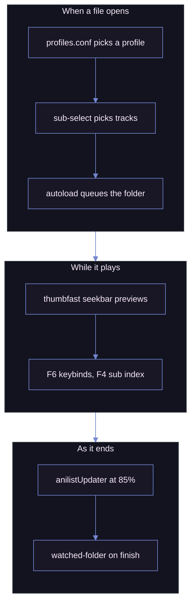

# MPV

My mpv setup: player settings, a keybind map I keep expanding, a [uosc][UOSC] theme, and the scripts I keep loaded.

| Playing, with the interface showing |
| ----------------------------------- |
| ![mpv playing][shot_playing]        |

> [!IMPORTANT]
> Two things are deliberately missing: the **shaders**, too large to commit, and the **[uosc][UOSC] folder**, taken from upstream. uosc carries one local change, kept in [`patches/`][patches_dir] rather than as a fork: run `just patch` after installing or updating it, or the menu reverts to stock.

## The uosc theme

Moonlight: dark, low-contrast, the interface kept thin, set in [`uosc.conf`][uosc_conf].

| Role              | Hex       | Used for                       |
| ----------------- | --------- | ------------------------------ |
| `foreground`      | `#ced9ff` | Timeline fill, active controls |
| `foreground_text` | `#0d0e17` | Text on top of that fill       |
| `background`      | `#191726` | Menus, tooltips, bars          |
| `background_text` | `#f8eaf8` | Text on those surfaces         |
| `curtain`         | `#0d0e17` | Dim behind open menus          |
| `success`         | `#49ef95` | Positive feedback              |
| `error`           | `#ca5f71` | Failures                       |

Shape matters as much: `timeline_style=bar` at 20px, `top_bar=no-border`, `border_radius=6`, `font_scale=1.18`, `font_bold=yes`. Most surfaces stop short of full opacity, and the title bar is fully transparent, so nothing floats over the video. Menus run at `submenu=1`, so every open level reads as one surface instead of fading back.

| At rest: the minimized timeline alone | Woken: top bar, controls, timeline |
| ------------------------------------- | ---------------------------------- |
| ![Minimized timeline][shot_minimal]   | ![Full interface][shot_interface]  |

`TAB` toggles the whole interface, `SHIFT+TAB` just that last bar. The timeline colours the ranges it recognises, so the OP, the ED and the preview read as bands rather than chapter ticks: `chapter_ranges` sets the colours, `chapter_range_patterns` teaches it the shorthand titles releases use.

### The menu patch

uosc centres whichever menu level is current and slides the whole stack to get there, so walking a path moves everything under the pointer. [`patches/uosc-cascade-menu.patch`][uosc_patch] makes it behave like a native context menu instead:

- the root opens where you clicked, and each submenu lines up with the item that opens it
- levels are placed by depth, so opening or leaving one never moves the others
- resting on an item walks in, resting on a parent column walks back out, no click needed; a pointer still travelling is ignored, so passing over an item never opens it
- the hovered entry's description and command are drawn under the menu, on top of every level

The folder is gitignored and uosc's updater overwrites it, so the change lives as a patch rather than as edits in the tree. [`patches/apply.py`][apply_py] applies it with the standard library alone.

## Install

`just first-run` walks the whole thing in nine stages: find or fetch mpv, unpack uosc and patch it, unpack the shaders, pick your keyboard layout, install the AniList packages, link your AniList account, put the config where mpv reads it. uosc, the shaders and the mpv build itself are pulled from their own releases, so nothing has to be downloaded or unzipped by hand. Every stage can be skipped, and re-running it is safe. [`first-run.py`][first_run] is standard library only, so `python first-run.py` works with no `just` and nothing installed.

It asks first where the config should live:

| Mode       | Where mpv goes                | The config                                              |
| ---------- | ----------------------------- | ------------------------------------------------------- |
| `here`     | into this repo folder         | read where it already sits, so an edit is live at once   |
| `system`   | the mpv you already have      | copied next to that executable                          |
| `portable` | a folder you name             | copied there, leaving anything existing alone            |

`here` is the one to pick if you plan to keep editing the config: `portable_config/` is already beside the executable, so there is nothing to copy and `just patch` lands on the uosc that mpv actually loads. The mpv payload in the repo root is gitignored.

Nothing is downloaded or written while it asks. The last stage is a receipt of every answer and every action queued, and only a yes there runs them.

| Start                          | The first question                     | The receipt, before anything runs  |
| ------------------------------ | -------------------------------------- | ---------------------------------- |
| ![Banner][shot_first_run_banner] | ![Install mode][shot_first_run_install] | ![Receipt][shot_first_run_receipt] |

### What has to be on the machine

| Tool         | Needed for                                                             | Without it                                        |
| ------------ | ---------------------------------------------------------------------- | ------------------------------------------------- |
| mpv          | everything                                                             | nothing runs                                      |
| ffmpeg       | `F4` subtitle index, subtitle export, chapter remux                    | those three fail silently at the moment you press |
| Python 3.8+  | `just patch`, the AniList scripts, `first-run.py`                      | no uosc patch and no AniList                      |
| [uv][uv]     | `just setup`, which vendors `requests` and `guessit`                   | `first-run.py` falls back to `pip`                |
| [just][just] | the recipes below                                                      | run the command inside each recipe by hand        |

mpv is not in this repo, and on Windows it has no official binary: mpv.io calls every Windows package an unofficial third-party build, apart from a first-party CI build meant for testing. Pick one from [mpv.io/installation][mpv_install].

By hand instead: copy `portable_config/` next to `mpv.exe`. You supply the two folders marked below.


The AniList scripts import `requests` and `guessit`. `just setup` installs both into `scripts/anilistUpdater/vendor/` with [uv][uv], so they do not depend on whatever `Lib` folder happens to sit next to `mpv.exe`; `just setup-check` reports whether mpv can import them. The folder is gitignored.

Shaders go under `shaders/`, and the Anime4K ones under `shaders/Anime4K/`: that folder name is written into `profiles.conf` and every `CTRL+1` through `CTRL+7` binding, so a flat `shaders/` folder loads nothing.

`F6` draws the keyboard named in [`keybind-visualizer.conf`][keybind_visualizer_conf], and it ships set to `abnt2`, a Brazilian layout. Change it to `ansi`, `iso` or `jis` to see your own keys.

## Scripts I wrote

Twelve, the interface ones all on the Moonlight palette.

### [`keybind-visualizer.lua`][keybind_visualizer]

An on-screen keyboard on `F6`. Hover a key to see what it does; `ESC` closes it.

Bindings are read live from `input-bindings`, with no list to maintain. `mpv.conf` sets `input-builtin-bindings=no`, so what the map draws is this config and its scripts and nothing of mpv's own: `input.conf` is the whole keymap.

| Searching every binding for `delay`         | Hovering a single key                     |
| ------------------------------------------- | ----------------------------------------- |
| ![Keyboard map, searching][shot_map_search] | ![Keyboard map, hovering][shot_map_hover] |

Type to search. The query matches key names, combos, descriptions and commands. Each word matches as a substring, as a gapped run inside one word, or as the initials of consecutive words, so a scatter of letters never lights up half the keyboard. A run may not wander past the end of a word: `sub-delay` is two words to the tokenizer, so `sd` reaches it through the initials rule while `sbdly` matches nothing. Matches are picked out inside each description. `BS` erases, `ESC` clears the query and then closes.

Results come as three columns: the combo, what it runs, and what that means. The command column drops the `no-osd` and `expand-properties` prefixes and the `osd_theme` message, and a binding running several commands shows the first with a `(+2)` for the rest.

Descriptions come from the trailing `#` comment on each `input.conf` line, which mpv hands back through `input-bindings`. A uosc menu line describes itself after `?` instead, since its `#!` comment already holds the menu path; parents in that path carry descriptions of their own, so the one after the last `?` is the entry's.

A `≡` badge marks anything that also lives in the uosc menu: in the corner of the key, and beside the binding's own line in the panel.

mpv cannot detect the OS keyboard layout, so layouts live in a JSON file. Pick `ansi`, `iso`, `abnt2`, `jis`, or add your own.

| File                                                            | Purpose                                                   |
| --------------------------------------------------------------- | --------------------------------------------------------- |
| [`keybind-visualizer.conf`][keybind_visualizer_conf]            | Selects the `layout` and points at the layouts file       |
| [`keybind-visualizer-layouts.json`][keybind_visualizer_layouts] | The layout definitions; edit to move keys or add a layout |

### [`sub-seek.lua`][sub_seek]

A fullscreen, clickable index of every subtitle line with timestamps, on `F4`. Click a line, or arrow to it and press Enter. The builtin sub-seek steps one line at a time; this jumps anywhere.

Type to filter: every word has to appear in the line, so `long line` keeps only those carrying both, and the hits are picked out where they sit. `BS` erases, `ESC` clears the query and then closes.

mpv exposes no "all subtitle lines" API, so the track is dumped to a temporary `.srt` with ffmpeg and parsed; ASS and embedded subs are flattened on the way.

| Every line of the track, the one playing highlighted | Filtered down to the lines that match         |
| ---------------------------------------------------- | --------------------------------------------- |
| ![Subtitle index][shot_sub_seek]                     | ![Subtitle index, searching][shot_sub_search] |

### [`uosc-menu.lua`][uosc_menu]

uosc builds its menu from the `#!` comments in `input.conf`, but those items get no icon and say nothing about themselves. This reads the same comments, understands two more tokens, and hands uosc the finished menu through its public `open-menu` message, so no uosc file is touched.

| Every entry with its icon and key | The hovered entry explained under the cascade |
| --------------------------------- | --------------------------------------------- |
| ![Menu root][shot_menu_root]      | ![Tools submenu][shot_menu_tools]             |

| Fonts as a radio group               | The Anime4K presets, six levels deep  |
| ------------------------------------ | ------------------------------------- |
| ![Font radio group][shot_menu_radio] | ![Anime4K cascade][shot_menu_cascade] |

| Speeds as a radio group               | Subtitle placement, the live one marked    |
| ------------------------------------- | ------------------------------------------ |
| ![Playback speed][shot_menu_playback] | ![Subtitle placement][shot_menu_placement] |

| Every loudness filter as a checkbox   | The colour controls                    |
| ------------------------------------- | -------------------------------------- |
| ![Audio loudness][shot_menu_loudness] | ![Picture controls][shot_menu_picture] |

<details>

<summary>The syntax, for when you edit the tree</summary>

```conf
g cycle interpolation   #! Video @movie > Interpolation @animation ?Resamples frames to the display rate
#                       #! Video > ---
```

| Token   | Does                                                                                     |
| ------- | ---------------------------------------------------------------------------------------- |
| `@name` | A [Material Icons Rounded][icons] ligature, on any part of the path                      |
| `?text` | What the entry does, shown under the menu on hover, next to the command it runs          |
| `---`   | A separator under the last entry of the level it sits in, so `Video > ---`, one level up |

</details>

Entries carrying a state draw it instead of their icon, re-read on open: `cycle <prop>`, `af toggle` and `change-list glsl-shaders toggle` become checkboxes, while entries setting the same property with `set <prop> <value>` become a radio group. Those keep the menu open when clicked and redraw in place, so a shader chain can be built in one visit.

The state is read from the first command on the line, with the prefix saying how it reports itself stripped first. Almost every binding here opens with `no-osd`, so matching the raw string left the whole tree stateless. Comments are found at the first `#` outside quotes, since a subtitle colour is written `"#80FFFFFF"` and cutting at the first `#` truncates the command.

Bound to `MBTN_RIGHT`, which anchors it at the pointer, and to `MENU` and the uosc menu button, which open it centred.

### [`chapters-menu.lua`][chapters_menu]

A uosc front end for [`chapters.lua`][chapters] on `c`, which ships eleven bindings and no way to see what any of them would do. Every chapter with its timestamp, the one playing marked; activating a row seeks and leaves the menu open, so you can walk the file and then act.

| Every chapter, and what can be done to them | The YouTube rules, checked one by one |
| ------------------------------------------- | ------------------------------------- |
| ![Chapter menu][shot_chapters]              | ![YouTube check][shot_chapters_check] |

Adding, renaming and deleting are done here rather than delegated. `chapters.lua` asks for a title through `mp.input`, which drops mpv's console over the video, and it acts on the chapter playing rather than the one you picked. Renaming uses a uosc palette prefilled with the current title instead, on `search_debounce = 'submit'` so nothing fires until Enter.

Exporting, remuxing and the in-place mkv rewrite are `chapters.lua`'s own and are called by name. Its YouTube validation, which used to dump twenty seconds of tab-aligned OSD text, is drawn as pass and fail rows, listing any chapter too short to qualify.

### [`sub-select-menu.lua`][sub_select_menu]

[`sub-select.lua`][sub_select] picks a subtitle track from the rules in `sub-select.json` and says nothing about it: not which rule won, not whether it ran at all. `ALT+SHIFT+s` draws the rules in plain words, marks the one that matched, names the track it chose, and offers a switch to stop it choosing.

| Which rule picked the track showing right now |
| --------------------------------------------- |
| ![Automatic subtitle selection][shot_subsel]  |

The rules, the match and the on/off state reach the menu from `sub-select.lua` over `user-data`, which is the only place any of them is known. That is six added lines in a vendored script, and an upstream pull reverts them.

### [`sub-font.lua`][sub_font]

One font choice, whichever kind of subtitle file turns up. Plain text subtitles carry no styling, so mpv draws them with `sub-font`; ASS scripts carry their own styles and only listen to `sub-ass-style-overrides`, which does nothing for plain text.

This mirrors `sub-font` into a `FontName` override, leaving other overrides alone, so `F8` and `Subtitle > Font` land on both. `script-message-to sub_font use-file-font` drops the override again, for when an ASS script should use the typeface it names. ASS styling only gives way when `sub-ass-override` is `yes` or higher, which `u` toggles.

### [`osd-theme.lua`][osd_theme]

One shape for every message a keybind puts on screen, so `sub-ass-override force` never reaches the screen as bare `force`. Bindings call `script-message-to osd_theme say "<label>" "<state>" "<detail>"`. The script paints the label, colours the state green or red for a plain on or off, and sets the detail below it in a smaller, quieter line saying what the setting does.

| The message a keybind leaves on screen | Work that takes a while, with the same spinner uosc uses |
| -------------------------------------- | -------------------------------------------------------- |
| ![Themed OSD message][shot_osd_theme]  | ![Busy message][shot_osd_busy]                           |

Scripts call the same message rather than `mp.osd_message`, so `F4`, `ALT+F5`, `F8` and the menu all speak in this shape too: `mp.commandv("script-message-to", "osd_theme", "say", label, state, detail)`.

A second message, `busy`, stays on screen instead of fading, for work slow enough that a message which disappeared would read as nothing happening. It turns the `autorenew` glyph from the icon font uosc already ships, so a wait here spins exactly what a uosc menu spins, and a later `say` both replaces the text and stops the spinner. Repeated calls only swap the words, so progress can climb without the icon stuttering. A third, `clear`, takes the message away without printing another, for a script like `sub-seek.lua` that spins while it works and then draws its own full screen list over the same corner.

Colours are the blues and greys of the [Moonlight palette][moonlight] my shell prompt uses, held at the top of the file, so retinting everything is one edit there. Outline and shadow take the palette's background rather than black. Bindings prefix the mutating command with `no-osd` so mpv's own readout does not double up, and prefix the message with `expand-properties` when the state comes from a property.

### [`reset-all.lua`][reset_all]

`ALT+F5` returns playback to a fresh-start state without reloading the file: zoom, pan, aspect, rotation, panscan, speed, both delays, subtitle scale, position and visibility, and the colour controls, then clears `glsl-shaders`. Volume and mute are left alone, so a reset never blasts audio.

### [`pause-indicator.lua`][pause_indicator]

A pause glyph in the top right corner. Descended from [CogentRedTester's][crt] version, which drew a `⏸` mid-screen in whatever system font mpv fell back to, so the box and bars sat off centre.

This draws the icon from the font uosc already ships, at a size and margin derived from the current OSD, so it stays symmetric and matches the rest of the interface. The original is kept in `.unused/pause-indicator-middle.lua`.

### [`skip-chapters.lua`][skip_chapters]

Auto-skips chapters titled as an opening, ending, credits or preview, with `F11` turning it off when a release names its chapters badly. The patterns are lowercase and anchored, so `^op$` does not swallow a chapter called "Opening Ceremony". Both the toggle and the skip itself announce through `osd-theme`, naming the chapter being jumped.

### [`restart-mpv.lua`][restart_mpv]

`F5` relaunches the player on the same file at the same position, so a config edit can be tested without losing your place.

### [`watched-folder.lua`][watched_folder]

`F10` toggles it; when on, a finished file is moved into a `watched` subfolder. The toggle draws through `osd-theme` and names the file queued to move, since the move itself only happens once the next file starts. Two known bugs: it fires when you switch files without finishing, and it skips the last file in a playlist.

## AniList, rewritten around the player

[`anilistUpdater`][anilist] is [AzuredBlue's][anilist_src], and marks the episode watched at 85%. Everything below is local, so an upstream pull reverts it.

| Everything the panel knows about the file playing |
| ------------------------------------------------- |
| ![AniList panel][shot_anilist]                    |

`n` opens the panel; `CTRL+n` marks the episode watched without opening anything. The panel names the match, the status and progress saved on your list, and, for a series still airing, when the next episode lands. Progress reads `4/10` once a series has finished, `4/10+` while it is still running, and a bare number when nothing knows the total.

A wrong guess is fixed from the same panel: search AniList by name, or paste a URL or a bare id into the search box. The correction is stored against a key built from what guessit parsed, the episode title and the season, so pinning one entry never drags an unrelated season of the same show along with it.

To get a token, open [the authorize link][anilist_auth] and approve it: the client id in that URL is the public one [AzuredBlue's README][anilist_src] hands out, so there is no application to register. AniList then shows the token on the page; copy it and press `CTRL+n` on the panel's link row.

The token is no longer a text file next to the scripts. `CTRL+n` on the link row reads it from the clipboard and hands it to Python over stdin rather than argv, keeping it out of the process list, and it is stored with `CryptProtectData` under `%LOCALAPPDATA%\mpv-anilist\`. That is outside the config tree, so it cannot be committed or synced, and it is tied to the Windows account, so a copied file is inert on another machine. Moving the config to a new PC means entering the token again. When AniList rejects an expired token the panel says so and points at the row that fixes it.

One fix reached the API layer: the original sent the token only on writes, so every lookup went out unauthenticated and came back `403`. It is sent on every request now.

## Configuration

| File                            | What it holds                                                                                  |
| ------------------------------- | ---------------------------------------------------------------------------------------------- |
| [`mpv.conf`][mpv_conf]          | Preferred languages, OSC and window behaviour, subtitle styling, video output and tone mapping |
| [`input.conf`][input_conf]      | Every keybind, plus the uosc menu                                                              |
| [`profiles.conf`][profile_conf] | Conditional profiles                                                                           |
| [`fonts.conf`][fonts_conf]      | Legacy; loaded Windows fonts before `fonts/` replaced it                                       |

| Bindings grouped by keyboard row             | The menu, written on the same lines       |
| -------------------------------------------- | ----------------------------------------- |
| ![input.conf, function rows][shot_conf_keys] | ![input.conf, menu block][shot_conf_menu] |

`input.conf` is the piece I put the most into: my active bindings among the commented ones I keep for reference, then the shader keys and the uosc menu.

`profiles.conf` swaps the shader chain and subtitle styling when the path contains `Animation`, plus profiles for audio-only files and upscaling.

## Script selection

Most run off playback events, no keypress needed.



<details>

<summary>The ten scripts I did not write</summary>

Each carries an added header line naming its upstream, so a file on disk always says where it came from. Beyond that, the three at the top differ; the rest are stock.

| Script                                           | Source                            | What it does                                    | Local change                                                                                                               |
| ------------------------------------------------ | --------------------------------- | ----------------------------------------------- | -------------------------------------------------------------------------------------------------------------------------- |
| [`thumbfast.lua`][thumbfast]                     | [po5][thumbfast_src]              | Seekbar hover thumbnails                        | Expands `~~/` in `mpv_path`; a 10s watchdog kills a hung spawn                                                             |
| [`sub-export.lua`][sub_export]                   | [kelciour][kelciour]              | Extracts the current subtitle next to the video | Runs in the background rather than freezing the player; spinner and percentage from ffmpeg's own progress; themed messages |
| [`skip-to-silence.lua`][skip_silence]            | [detuur][detuur]                  | Jumps to the next silence, usually the OP's end | `F9` rather than `F3`; themed message                                                                                      |
| [`anilistUpdater`][anilist]                      | [AzuredBlue][anilist_src]         | Marks the episode watched on AniList at 85%     | [Rewritten around the player](#anilist-rewritten-around-the-player)                                                        |
| [`autoload.lua`][autoload]                       | [mpv][autoload_src]               | Queues the neighbouring files in the folder     | Stock                                                                                                                      |
| [`chapters.lua`][chapters]                       | [mar04][chapters_src]             | Create, edit and save chapters                  | Stock; driven by [`chapters-menu.lua`][chapters_menu] rather than its own bindings                                         |
| [`clipshot.lua`][clipshot]                       | [ObserverOfTime][clipshot_src]    | Screenshot straight to the clipboard            | Stock                                                                                                                      |
| [`sub-select.lua`][sub_select]                   | [CogentRedTester][sub_select_src] | Picks audio and subtitle tracks by rules        | Publishes its rules and its match over `user-data`, for [`sub-select-menu.lua`][sub_select_menu]                           |
| [`reactive_vf_bypass.lua`][vf_bypass]            | [allecsc][allecsc]                | Keeps the SVP filter chain honest               | Stock                                                                                                                      |
| [`reactive_vf_bypass_keyword.lua`][vf_bypass_kw] | [allecsc][allecsc]                | The same, matched by keyword                    | Stock                                                                                                                      |

</details>

Everything here is formatted with the same [stylua][stylua] settings as the rest of the repo, so a plain diff against upstream is mostly reindentation. Run upstream through stylua first and only the changes named above remain.

<details>

<summary>Scripts kept but not loaded</summary>

Tried and dropped, kept for reference in `scripts/.unused/`, which mpv skips: `autodeint.lua`, `better-chapter.lua`, `inputevent.lua`, `memo.lua`, `mute-on-specific-subtitle-words.js`, `osc.lua`, `pause-indicator-middle.lua`, `sub-bilingual.lua`.

</details>

## Shaders and fonts

Shaders, [Anime4K][Anime4k] among them, are too large to commit; [`shaders_list.txt`][shaders_list] names them. Fonts sit in `fonts/`, which loads faster than the Windows font folder.

<!-- URLS -->

[shot_playing]: assets/mpv-playing.png
[shot_map_search]: assets/keybind-visualizer-search.png
[shot_map_hover]: assets/keybind-visualizer-hover.png
[shot_osd_theme]: assets/osd-theme.png
[shot_sub_seek]: assets/sub-seek.png
[shot_sub_search]: assets/sub-seek-search.png
[shot_menu_root]: assets/uosc-menu-root.png
[shot_menu_tools]: assets/uosc-menu-tools.png
[shot_menu_radio]: assets/uosc-menu-radio.png
[shot_menu_cascade]: assets/uosc-menu-cascade.png
[shot_menu_playback]: assets/uosc-menu-playback.png
[shot_menu_placement]: assets/uosc-menu-placement.png
[shot_menu_loudness]: assets/uosc-menu-loudness.png
[shot_menu_picture]: assets/uosc-menu-picture.png
[shot_chapters]: assets/chapters-menu.png
[shot_chapters_check]: assets/chapters-menu-check.png
[shot_subsel]: assets/sub-select-menu.png
[shot_anilist]: assets/anilist-menu.png
[shot_osd_busy]: assets/osd-theme-busy.png
[shot_minimal]: assets/uosc-minimal.png
[shot_interface]: assets/uosc-chrome.png
[shot_conf_keys]: assets/input-conf-keys.png
[shot_conf_menu]: assets/input-conf-menu.png
[shot_first_run_banner]: assets/first-run-banner.png
[shot_first_run_install]: assets/first-run-install.png
[shot_first_run_receipt]: assets/first-run-receipt.png
[patches_dir]: ./patches
[keybind_visualizer]: ./portable_config/scripts/keybind-visualizer.lua
[keybind_visualizer_conf]: ./portable_config/script-opts/keybind-visualizer.conf
[keybind_visualizer_layouts]: ./portable_config/script-opts/keybind-visualizer-layouts.json
[sub_seek]: ./portable_config/scripts/sub-seek.lua
[Anime4k]: https://github.com/bloc97/Anime4K
[UOSC]: https://github.com/tomasklaen/uosc
[mpv_conf]: ./portable_config/mpv.conf
[input_conf]: ./portable_config/input.conf
[profile_conf]: ./portable_config/profiles.conf
[fonts_conf]: ./portable_config/fonts.conf
[uosc_conf]: ./portable_config/script-opts/uosc.conf
[shaders_list]: ./portable_config/shaders/shaders_list.txt
[anilist]: ./portable_config/scripts/anilistUpdater
[anilist_src]: https://github.com/AzuredBlue/mpv-anilist-updater
[autoload]: ./portable_config/scripts/autoload.lua
[autoload_src]: https://github.com/mpv-player/mpv
[chapters]: ./portable_config/scripts/chapters.lua
[chapters_src]: https://github.com/mar04/chapters_for_mpv
[clipshot]: ./portable_config/scripts/clipshot.lua
[clipshot_src]: https://github.com/ObserverOfTime/mpv-scripts
[pause_indicator]: ./portable_config/scripts/pause-indicator.lua
[crt]: https://github.com/CogentRedTester/mpv-scripts
[vf_bypass]: ./portable_config/scripts/reactive_vf_bypass.lua
[allecsc]: https://github.com/allecsc/mpv-qol-scripts
[osd_theme]: ./portable_config/scripts/osd-theme.lua
[reset_all]: ./portable_config/scripts/reset-all.lua
[sub_font]: ./portable_config/scripts/sub-font.lua
[uosc_menu]: ./portable_config/scripts/uosc-menu.lua
[chapters_menu]: ./portable_config/scripts/chapters-menu.lua
[sub_select_menu]: ./portable_config/scripts/sub-select-menu.lua
[uv]: https://github.com/astral-sh/uv
[just]: https://github.com/casey/just
[first_run]: ./first-run.py
[mpv_install]: https://mpv.io/installation/
[anilist_auth]: https://anilist.co/api/v2/oauth/authorize?client_id=20740&response_type=token
[uosc_patch]: ./patches/uosc-cascade-menu.patch
[apply_py]: ./patches/apply.py
[restart_mpv]: ./portable_config/scripts/restart-mpv.lua
[skip_silence]: ./portable_config/scripts/skip-to-silence.lua
[detuur]: https://github.com/detuur/mpv-scripts
[sub_export]: ./portable_config/scripts/sub-export.lua
[kelciour]: https://github.com/kelciour/mpv-scripts
[sub_select]: ./portable_config/scripts/sub-select.lua
[sub_select_src]: https://github.com/CogentRedTester/mpv-sub-select
[thumbfast]: ./portable_config/scripts/thumbfast.lua
[thumbfast_src]: https://github.com/po5/thumbfast
[watched_folder]: ./portable_config/scripts/watched-folder.lua
[icons]: https://fonts.google.com/icons?icon.set=Material+Icons&icon.style=Rounded
[moonlight]: https://github.com/v-amorim/oh-my-posh
[skip_chapters]: ./portable_config/scripts/skip-chapters.lua
[vf_bypass_kw]: ./portable_config/scripts/reactive_vf_bypass_keyword.lua
[stylua]: https://github.com/JohnnyMorganz/StyLua
